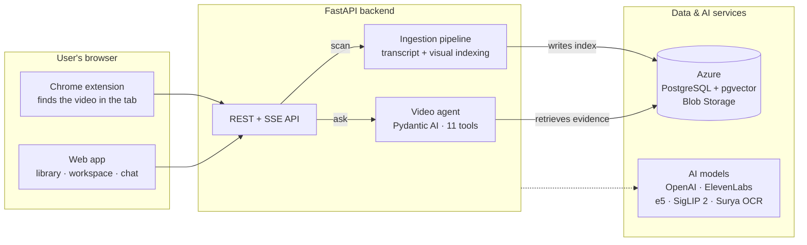
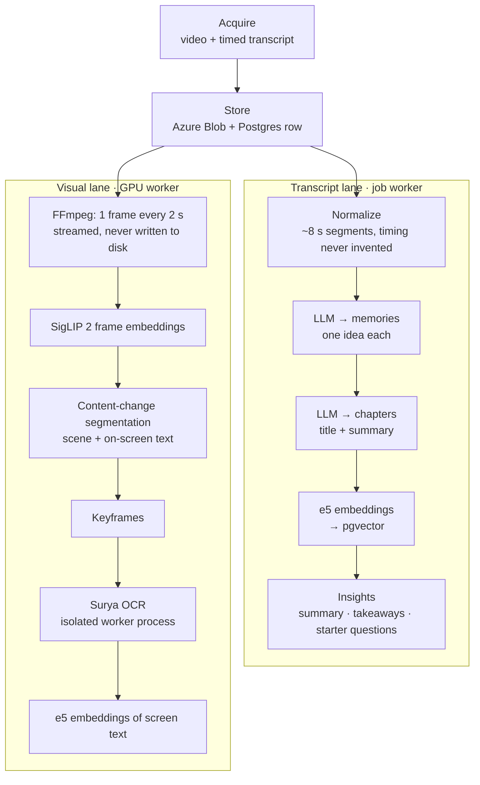
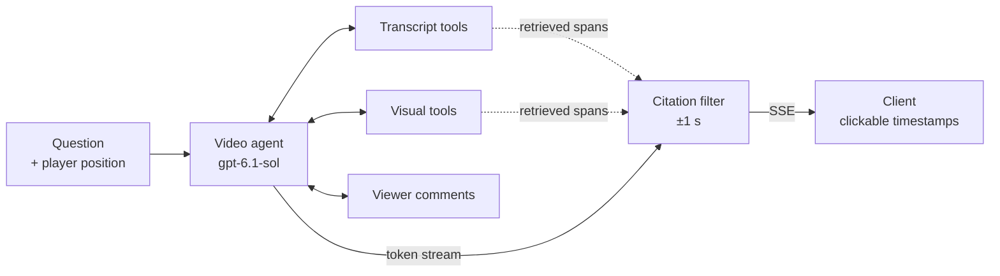
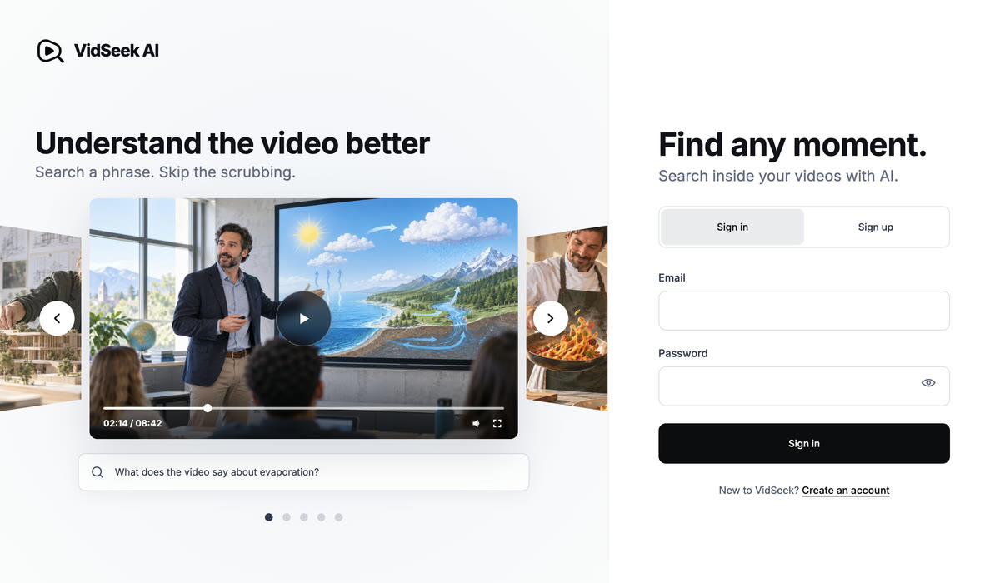

<div align="center">

<h1>
  <picture>
    <source media="(prefers-color-scheme: dark)" srcset="images/readme/logo-light.png" />
    
  </picture>
  VidSeek AI
</h1>

**Ask any video anything.** A Chrome extension and web app that turn the video in your browser tab into a conversation about what was said, what was shown, and when. Every timestamp in an answer is checked against retrieved evidence.


</div>

## 🎬 Watch it

| [](https://drive.google.com/file/d/1nLpSrvlrQ4ulZq_ih36OZMnX-x2wVjbm/view?usp=sharing) | [](https://drive.google.com/file/d/1XM35D6wu7_r2d-2qUCMLTYBHydQmCYWz/view?usp=sharing) | [](https://drive.google.com/file/d/190IBrqsLmJo0ctHglXR8zCOwi_hUDnVc/view?usp=sharing) |
|:--:|:--:|:--:|
| **Product promo** · 1:19 | **Architecture walkthrough** · 3:54<br/>How it works and the decisions behind it | **Full video** · 5:13<br/>Promo followed by the walkthrough |

<sub>All three videos open in Google Drive. The <code>.mp4</code> files are also attached to the <a href="https://github.com/shachar-bz/VidSeek-AI/releases/tag/v1.0.0">v1.0.0 release</a>.</sub>

---

## Overview

Long videos are hard to search. The answer might be one sentence at minute 37, a formula on a slide, or an action nobody says out loud.

VidSeek AI gets the video from the page you're watching and indexes both the **speech** and the **picture**. It answers questions through a **tool-using agent** that retrieves only the evidence it needs, and checks every timestamp it cites against that evidence.

- **Works on the sites you already use.** One click in a Chrome side panel finds the main video on the page: direct files, HLS and DASH streams, or embedded players. It filters out ads and refuses DRM content.
- **Understands speech and picture.** Transcripts become semantic *memories* and *chapters*. Frames are embedded with SigLIP 2 and segmented by content change, and their on-screen text is read with OCR.
- **Agentic retrieval with verified citations.** 11 tools search the transcript, the picture and on-screen text. A streaming filter drops any `[MM:SS]` the evidence doesn't support, and clicking a citation seeks the video.
- **Progressive availability.** You can chat about the transcript while visual indexing is still running.
- **A personal library.** Videos, chats and pinned answers live in one workspace, with live processing progress. Sources that were already processed are reused instead of processed again.

| Layer | Stack |
|---|---|
| **Web app** | React 18, TypeScript, Vite, React Router |
| **Chrome extension** | Manifest V3 side panel, TypeScript, Chrome DevTools Protocol |
| **Backend** | Python, FastAPI, Pydantic, Server-Sent Events, psycopg 3 |
| **Agent** | Pydantic AI on the OpenAI Responses API: `gpt-6.1-sol` (agent), `gpt-6-luna` (vision) |
| **Speech** | Native captions via yt-dlp, ElevenLabs Scribe v2, ElevenLabs forced alignment |
| **Embeddings & OCR** | `multilingual-e5-small` (text), SigLIP 2 (image–text), Surya OCR |
| **Data & media** | PostgreSQL + pgvector, Azure Blob Storage, FFmpeg |

---

## Extension & video ingestion


The extension is a Manifest V3 side panel: *Find video → Scan video → live progress → chat*.

| Signal | How it is read |
|---|---|
| Page DOM | `<video>`, `<source>`, `<track>`, in-memory text tracks and `og:video`, including inside shadow roots |
| Embedded players | Every frame is inspected in its own context; YouTube embeds are recognised |
| Network | Resource Timing, plus opt-in Chrome DevTools Protocol capture during a playback check |
| Player data | JSON, JSON-LD and inline-script JSON, parsed without `eval` |
| Captions | Track files fetched *inside the frame that owns them*, with the page's own credentials |

- **Main content vs. ads.** Ad hosts and JSON flagged as ads are dropped, and HLS renditions are folded into their master playlist. If streams appear only during playback, a short *playback check* ranks them by length and by how much was played. Short clips are flagged as a likely ad or intro.
- **Transcript panels without site-specific code.** The extension reads an open transcript panel by its accessibility labels, scrolling virtualised lists to collect every row. The result is accepted only if it covers the whole video.
- **DRM is refused, not bypassed.** Protection is detected from manifest tags, license-server traffic and an EME monitor. If DRM is found, nothing is downloaded.
- **LLM fallback for unfamiliar player JSON.** `gpt-6.1-sol` sees only a privacy-preserving inventory: paths, hosts, key names and value types. It never sees full URLs, cookies or caption text, and it returns only field mappings. The backend validates those mappings against every row and abstains on any violation.

| Source | Acquisition |
|---|---|
| **YouTube** | yt-dlp, plus top comments via the YouTube Data API |
| **Direct file** | `chrome.downloads` in the user's own session |
| **HLS / DASH / embedded player** | yt-dlp + FFmpeg with the user's cookies and allow-listed headers |

Transcripts reuse existing captions whenever possible. The order is page captions, then platform subtitles, then forced alignment of untimed English text, with ElevenLabs Scribe speech-to-text as the last resort. The promo shows the product working on **YouTube, Coursera, TED, Internet Archive and Moodle/Panopto**.

**Security**
- **Locked-down API.**
  - CORS and extension-ID allowlists, plus session tokens bound to the requesting origin.
  - An SSRF guard requires every resolved IP to be public and re-checks each download request and redirect.
- **Minimal credential exposure.**
  - Forwarded headers are allow-listed, and `Authorization` is stripped on cross-origin requests.
  - Cookies go into a `0600` jar that is deleted after use, and cookies and headers are wiped from memory when the job ends.
  - Host permissions are requested per origin and revoked after each job.
- **Validated media.** Every download must pass `ffprobe` with a real video stream.

---

## Architecture



**Life of a video:** *Find* (extension) → *Scan* (job, deduplicated by source) → *Acquire* (media + timed transcript) → *Index* (text and visual lanes in parallel) → *Ask* (agent + verified citations). The web app and the extension share one account, one API and the same conversations.

---

## Video processing & indexing pipeline

Each stored video is indexed along two lanes on separate workers. Transcript chat is usually ready before the visual index finishes.



**Transcript lane**
- **The LLM structures the transcript but never rewrites it.** `gpt-6.1-sol` with Structured Outputs sees numbered transcript segments and returns only memory boundaries and summaries. The code checks that the memories cover the transcript exactly once, with no gaps or overlaps, and copies text and timing from the source. A second pass groups the memories into titled, summarised chapters.
- **Embeddings and insights.** Memories, OCR text and YouTube comments are embedded with `multilingual-e5-small`. `gpt-6-luna` writes a summary, key takeaways and starter questions.

**Visual lane**
- **Content-change segmentation, no shot detector.**
  - A *scene change* is a SigLIP cosine distance of 0.15 or more.
  - A *text change*, such as a new slide, is a perceptual-hash difference of 12 bits or more on a stable picture.
  - A change must persist across two agreeing samples, which filters out flashes and people walking through the shot.
- **Keyframe OCR.** Each segment's first stable frame, plus one more every 60 s, is decoded again at full resolution and read by Surya OCR in its own worker process. A text detector runs first, so frames with no text are skipped.

**Readiness & reliability**
- **Progressive readiness.**
  - Chat unlocks once the transcript, chapters, embeddings and insights exist.
  - Visual tools join the agent when the frame index is ready.
  - OCR coverage then grows batch by batch. The agent knows how many keyframes are still unread, so an empty result isn't taken as proof of absence.
- **GPU-aware concurrency.** The next video's transcript stages overlap the previous video's visual indexing, but no two visual runs ever share the GPU.
- **Deduplication.** Sources are matched by canonical URL before download, so a known video joins the library instantly.
- **Atomic, versioned visual index.** The index is written in one transaction and tagged `siglip2-base-patch16-256@0.5fps`. Interrupted indexing resumes automatically on restart.

---

## AI agent & retrieval

The agent never loads the whole transcript or every frame into context. It calls tools to find candidate evidence, inspects it, and answers from what it retrieved.



| Tool | What it does |
|---|---|
| `get_video_outline` | Chapter titles, summaries and times |
| `memories_semantic_search` | Finds passages by meaning (e5 + pgvector, per-video z-score cutoff) |
| `get_chapter_context` · `get_memory_context` | A whole chapter, or one passage's exact wording with its neighbours |
| `get_video_info` | Title, source and transcript language |
| `search_visual_moments` | Natural-language picture search (SigLIP 2 over frames sampled every 2 s) |
| `search_screen_text` | Finds slide, code or whiteboard text (OCR, semantic and exact match) |
| `view_candidates` | Shows unrelated moments in one contact sheet; the vision model rates each *yes / no / unclear* |
| `view_sequence` | 2–9 time-ordered frames to watch an action unfold (scene-cut aware) |
| `view_frames_closeup` | 1–3 full-detail frames sent to the main model |
| `get_viewer_comments` | Top YouTube comments, or the ones that best match the question |

### Design decisions

- **Adaptive relevance, not fixed top-k.** A hit must score at least 1.5 standard deviations above *that video's own* similarity distribution, so "nothing relevant here" is a possible answer.
- **Look before you cite.** Picture-search hits are only candidates. They become citable once a look tool has inspected the frame. Contact sheets and sequences go to a separate vision model (`gpt-6-luna`), which returns structured per-frame observations.
- **Bounded visual cost.** Each answer may use at most 6 visual calls and 4 looks. After that, the agent must answer with what it has and say what it couldn't confirm.
- **Citations verified while streaming.** Each `[MM:SS]` is held back until it closes. It is dropped unless both ends fall inside a span a tool returned (±1 s). Spans are stored per message, so follow-up answers can cite earlier evidence.
- **State-aware tools.** Visual tools stay hidden until the frame index is ready. Each question carries the player's position, so "what's on screen right now?" works.

**Evaluated, not just demoed.** The [evaluation report](VIDEO_AGENT_EVAL_REPORT.md) runs 18 scenario tests on 6 videos, twice each, through the production agent. Every claim was checked against the database and extracted frames.

- 16 of the 18 tests pass in both runs.
- The agent invented 0 facts.
- Every citation in all 36 answers falls inside a tool-returned span.
- Median latency is about 9–10 s.

The remaining failures are documented with their root causes.

---

## Web app

|  |  |  |
|:--:|:--:|:--:|
| **One account on both surfaces.** Users sign up with email and password in the web app or the extension's side panel. Both use the same auth API, and every sign-in becomes its own session. | **Video workspace:** player, a transcript that follows playback, summary and chapters, multiple chats and pinned answers | **Library:** filters, tags and renaming, with live job progress over SSE |

Answers stream as typed SSE events (`token`, `tool_call`, `tool_result`, `message_complete`), with short activity labels such as *"Searching the picture"*. They can be stopped mid-stream, and the partial answer is kept.

**Clickable timestamps**
- **Every citation is a button.** The agent cites `[MM:SS–MM:SS]` spans. The web app parses them with the same pattern as the backend's citation filter and turns each one into a button, even while the answer is still streaming. Clicking it seeks the player to the start of the span.
- **One player, many ways in.** Citations, transcript lines and chapters all seek the same HTML5 player. The transcript highlights the current line and keeps it centred. Scrolling by hand pauses that for 6 s and shows a *Follow playback* button.
- **Pinned answers stay live.** Opening a pin jumps to that message in its conversation, where its citations are clickable again.
- **In the extension, the jump happens in your own tab.** The side panel finds the largest loaded `<video>` across every frame of the page and sets its time, so it works with any site's player, YouTube included.

---

See [**REPOSITORY_STRUCTURE.md**](REPOSITORY_STRUCTURE.md) for a map of the codebase.

<details>
<summary><b>Getting started</b></summary>

**Requirements:** Python 3.11+, Node 20+, FFmpeg, a PostgreSQL server with `pgvector`, an Azure Blob container, and API keys for OpenAI, ElevenLabs and the YouTube Data API. A CUDA GPU is recommended for visual indexing.

```sh
# Backend
python -m venv .venv && .venv/bin/pip install -r backend/requirements.txt
cp backend/.env.example backend/.env           # fill in keys; every setting is documented inline
.venv/bin/python -m backend.storage.postgres.migrate
.venv/bin/uvicorn backend.app:app --host 127.0.0.1 --port 8765

# Web app
cd frontend && npm install && npm run dev

# Chrome extension: load chrome-extension/dist via chrome://extensions → Load unpacked
cd chrome-extension && npm install && npm run build
```

Copy the extension ID into `VIDSEEK_EXTENSION_IDS` in `backend/.env`. For screen-text search, set up the optional Surya OCR environment described under `VIDSEEK_OCR_PYTHON`.

</details>

---

<div align="center">

Built by **Shachar Ben Zur** · [GitHub](https://github.com/shachar-bz)

</div>
