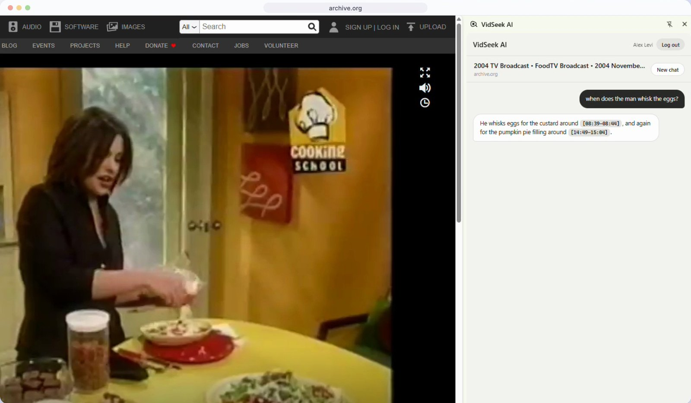
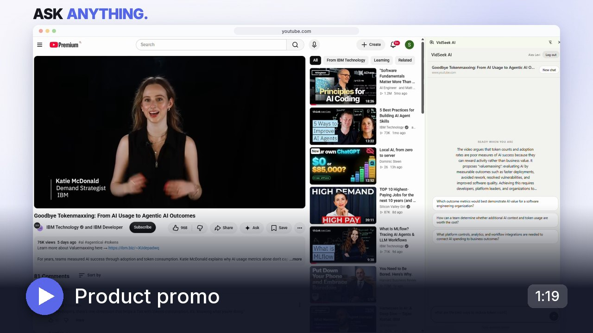
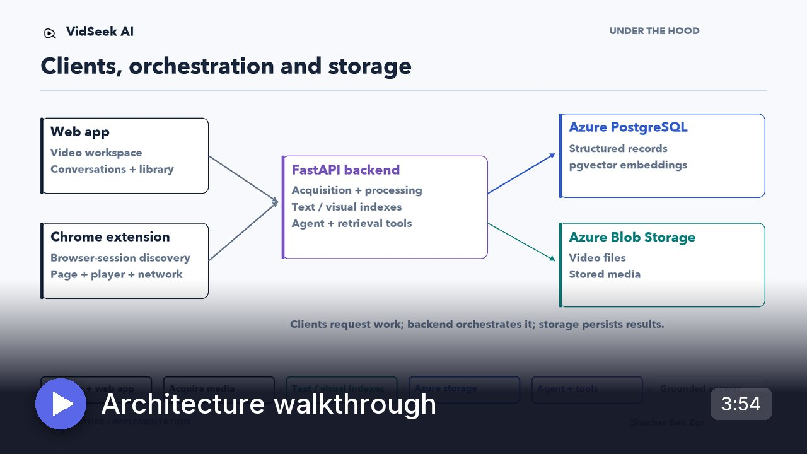
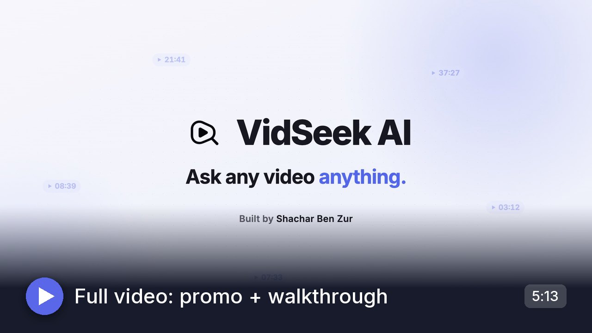
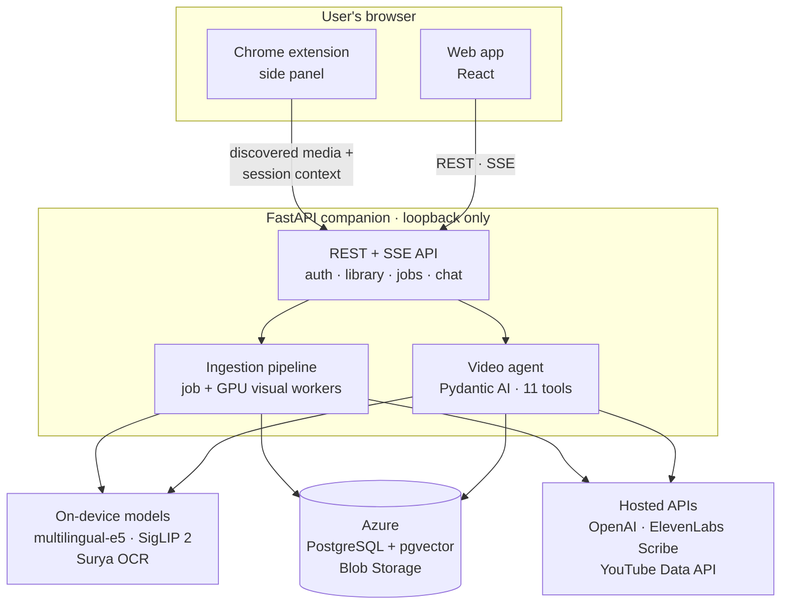
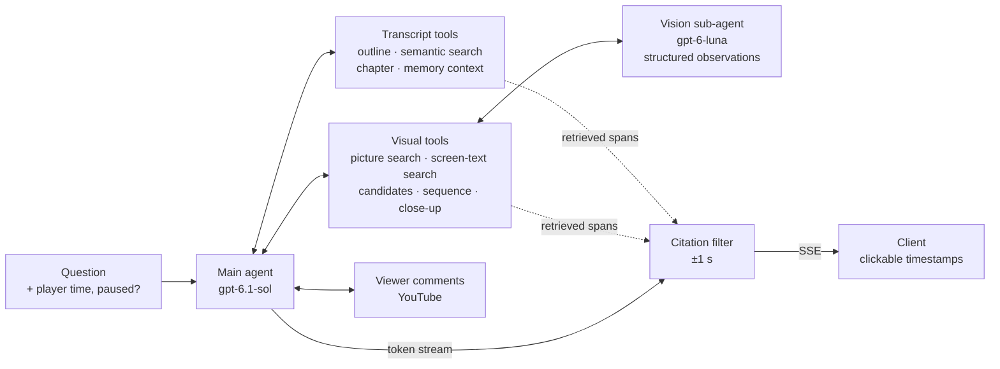
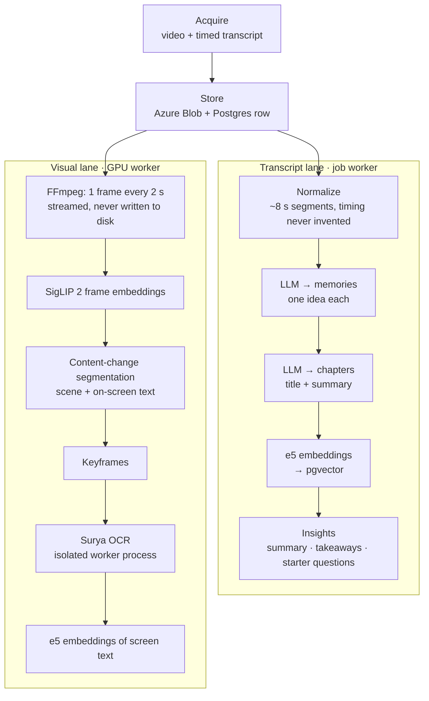
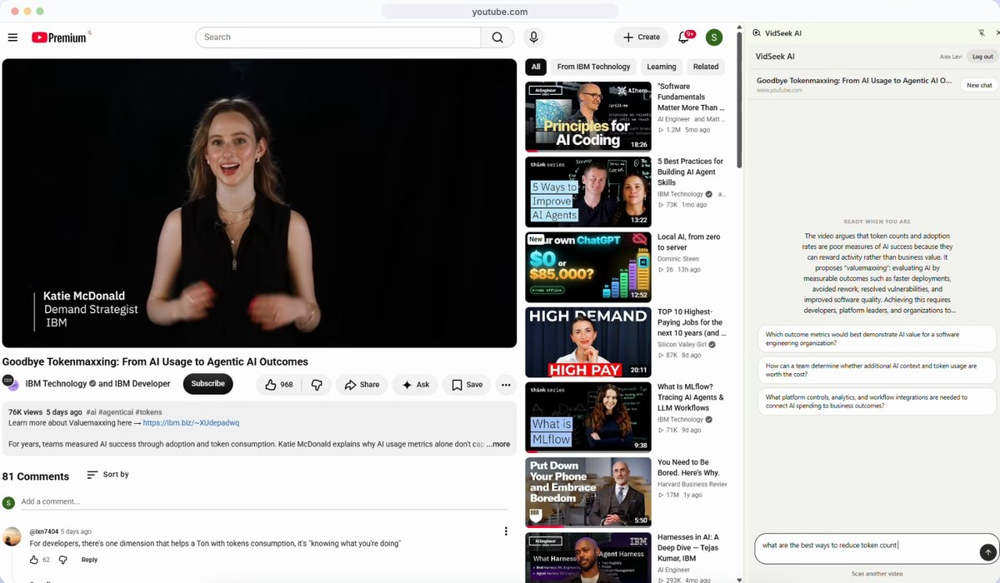
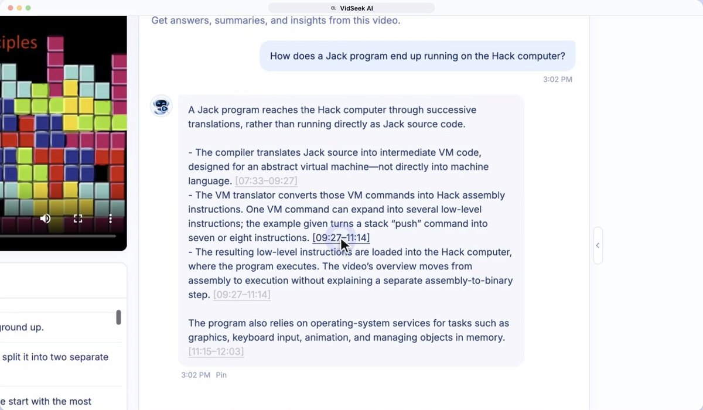
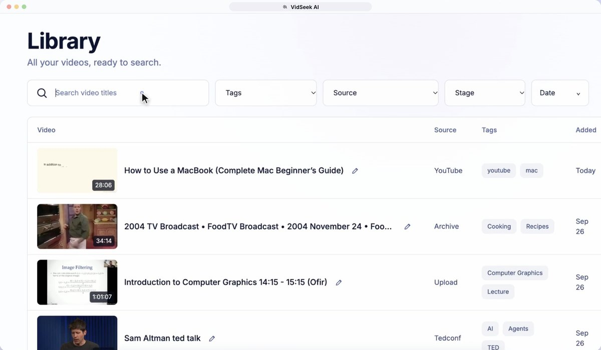

<div align="center">


# VidSeek AI

**Ask any video anything.** A Chrome extension and web app that turn the video in your browser tab into a conversation about what was said, what was shown, and when. Every timestamp in an answer is checked against retrieved evidence.




<sub>A visual question about a 34-minute Internet Archive broadcast, asked from the Chrome side panel. The agent found both moments by searching and inspecting frames. Each timestamp is clickable and seeks the video in the tab.</sub>

</div>

---

## 🎬 Watch it

| [](https://github.com/shachar-bz/VidSeek-AI/releases/download/v1.0.0/vidseek-promo.mp4) | [](https://github.com/shachar-bz/VidSeek-AI/releases/download/v1.0.0/vidseek-architecture-walkthrough.mp4) | [](https://github.com/shachar-bz/VidSeek-AI/releases/download/v1.0.0/vidseek-full-video.mp4) |
|:--:|:--:|:--:|
| **Product promo** · 1:19<br/>The product on YouTube, Coursera, TED, Internet Archive and Panopto | **Architecture walkthrough** · 3:54<br/>How it works and the decisions behind it | **Full video** · 5:13<br/>Promo followed by the walkthrough |

<sub>All three videos are attached to the <a href="https://github.com/shachar-bz/VidSeek-AI/releases/tag/v1.0.0">v1.0.0 release</a>.</sub>

---

## Overview

Long videos are hard to search. The answer you need might be one sentence at minute 37, a formula on a slide, or an action nobody says out loud.

VidSeek AI gets the video from the page you're watching, using your own browser session. It indexes both the **speech** and the **picture**. You then question the video through a **tool-using agent** that retrieves only the evidence it needs. Before any timestamp citation reaches you, it's checked against the time ranges the tools actually returned.

### Key capabilities

- **Works on the sites you already use.** One click in a Chrome side panel finds the main video on the page: direct files, HLS and DASH streams, or embedded players. It filters out ads and refuses DRM-protected content.
- **Understands speech and picture.** Transcripts are split into semantic *memories* and *chapters*. Frames are embedded with SigLIP 2, segmented into scenes, and keyframe text is read with OCR.
- **Agentic retrieval.** The agent has 11 tools for searching the transcript, the picture and on-screen text. A vision sub-agent can inspect sequences of frames.
- **Verified, clickable citations.** A streaming filter drops any `[MM:SS]` the evidence doesn't support. Clicking a citation seeks the video, in the web app or in the original tab.
- **Progressive availability.** You can chat about the transcript while visual indexing is still running. Visual tools join the agent when the frame index is ready.
- **A personal library.** Videos, chats and pinned answers live in one workspace, with live processing progress. If a source was already processed, the existing result is reused instead of processing it again.

| 11 | 2 | 1,224 | 0 |
|:--:|:--:|:--:|:--:|
| agent tools | parallel indexing lanes (text + visual) | automated tests | facts invented by the agent in 36 graded answers ([eval](VIDEO_AGENT_EVAL_REPORT.md)) |

### Technology

| Layer | Stack |
|---|---|
| **Web app** | React 18, TypeScript, Vite, React Router |
| **Chrome extension** | Manifest V3 side panel, TypeScript, Chrome DevTools Protocol (`chrome.debugger`) |
| **Backend** | Python, FastAPI, Pydantic, Server-Sent Events, psycopg 3 |
| **Agent** | Pydantic AI on the OpenAI Responses API: `gpt-6.1-sol` (reasoning agent), `gpt-6-luna` (vision) |
| **Speech** | Native captions via yt-dlp, ElevenLabs Scribe v2, ElevenLabs forced alignment |
| **Local models** | `multilingual-e5-small` (text, 384-d), `SigLIP 2 base` (image–text, 768-d), Surya OCR on llama.cpp |
| **Media** | yt-dlp, FFmpeg |
| **Data** | Azure Database for PostgreSQL + pgvector, Azure Blob Storage |
| **Testing** | pytest, Vitest, Testing Library |

---

## Architecture



**Why a local companion?** The backend runs on the user's machine and accepts loopback connections only. Two things follow:

- It can download videos **with the user's own browser session**. Cookies never leave the machine, and site permissions are revoked once the job ends.
- It can run the **GPU models locally**: SigLIP 2 and Surya OCR.

Durable state (videos, indexes, conversations) lives in Azure. The local download is deleted once it has been uploaded. The web app and the extension share one account, one API and the same conversations.

**Life of a video:** *Find* (extension) → *Scan* (job; deduplicated by source) → *Acquire* (media + timed transcript) → *Index* (text and visual lanes in parallel) → *Ask* (agent + verified citations).

---

## AI agent & retrieval

The agent never loads the whole transcript or every frame into context. It calls tools to find candidate evidence, inspects it, and answers from what it retrieved.



### Tools

| Tool | Purpose | Backed by |
|---|---|---|
| `get_video_outline` | Chapter map with titles, summaries and times | `chapters` |
| `memories_semantic_search` | Find passages by meaning | e5 vectors in pgvector, per-video z-score cutoff |
| `get_chapter_context` | Every memory summary in one chapter | `chapters`, `memories` |
| `get_memory_context` | Exact wording of a passage plus its neighbours, kept within its chapter | `memories` |
| `get_video_info` | Title, source, transcript origin and language | `videos` |
| `search_visual_moments` | Natural-language picture search | SigLIP 2 text→image over frames sampled every 2 s, best frame per visual segment |
| `search_screen_text` | Find slide, code or whiteboard text | OCR text: e5 semantic matches and exact-substring matches, returned as separate lists |
| `view_candidates` | Check several unrelated moments at once | Contact sheet → vision model gives each frame a *yes / no / unclear* verdict |
| `view_sequence` | Watch an action unfold over time | 2–9 time-ordered frames (scene-cut aware) → vision model |
| `view_frames_closeup` | Read fine detail | 1–3 frames at 1024 px, sent to the main model directly |
| `get_viewer_comments` | What viewers said (YouTube) | Top-liked comments, or e5 semantic search over them |

### Design decisions

- **Adaptive relevance, not fixed top-k.** A hit must score at least 1.5 standard deviations above *that video's own* similarity distribution. That way "nothing relevant here" can be a real answer, and the agent doesn't just get the best of a bad set.
- **Look before you cite.** Picture-search hits are only candidates. They can't be cited until a *look* tool has inspected the frame. A separate vision model returns structured per-frame observations, and the main agent combines them with transcript evidence.
- **Bounded visual cost.** Each answer may use at most 6 visual tool calls and 4 looks. After that the tools stop doing work and tell the agent to answer with what it has and to say what it couldn't confirm.
- **Citations verified while streaming.** The filter holds back each bracketed timestamp until it closes. It then drops the timestamp unless both ends fall inside a span a tool returned (±1 s). Spans are stored per message, so follow-up answers can cite earlier evidence.
- **Tools depend on video state.** Pydantic AI `prepare` hooks hide the visual tools until the frame index is ready, and hide the comments tool when a video has none. The prompt then tells the agent to say visual analysis is still processing.
- **Player-aware questions.** Each question carries the player's current time and whether it's paused, so "what's on screen right now?" works. A paused player gets a close-up of the current frame; a playing one gets a sequence over the last few seconds.
- **Frames on demand.** No inspection frames are pre-stored. FFmpeg seeks into the stored video through a 10-minute read-only SAS URL and pulls JPEG frames in parallel.

### Evaluated, not just demoed

[`VIDEO_AGENT_EVAL_REPORT.md`](VIDEO_AGENT_EVAL_REPORT.md) covers 18 scenario tests on 6 videos. Each was run twice through the production agent and citation filter, and every claim was checked against the database and against frames extracted every 1–3 s.

- **Grades:** 16/18 pass in both runs.
- **Grounding:** the agent invented 0 facts, and every citation in all 36 answers falls inside a tool-returned span.
- **Latency:** median about 9–10 s.
- **Failures are documented:** each remaining failure has a root-cause analysis, including one misread by the vision model.

---

## Video processing & indexing pipeline

After the video is stored, it is processed along two lanes on separate workers. The transcript lane runs on the job worker; the visual lane runs on a dedicated GPU worker.



### Transcript lane

- **The LLM structures the transcript but never rewrites it.** `gpt-6.1-sol`, called with Structured Outputs, sees numbered transcript segments and returns only boundaries and summaries. The code checks that the memories cover the transcript exactly once, with no gaps or overlaps. Text and timing are then copied from the original segments.
- **Chapters come from summaries.** A second pass groups memories into titled, summarised chapters, reading only the memory summaries.
- **Embedding.** Each memory is embedded as *chapter title + memory summary + text* with `multilingual-e5-small`, which runs locally at no per-call cost. YouTube comments and OCR text are embedded the same way.
- **Insights.** `gpt-6-luna` writes a summary, key takeaways and starter questions from the chapter and memory summaries. These appear when a video is opened.

### Visual lane

- **Sampling.** A single FFmpeg pass extracts frames at 0.5 fps, scaled to 384 px and piped straight to the encoder.
- **Content-change segmentation**, without a shot-detection model:
  - A *scene change* is a SigLIP cosine distance of 0.15 or more from the segment's reference frame.
  - A *text change* is a 64-bit DCT perceptual-hash distance of 12 bits or more, counted only once the picture is stable. This catches slide changes that barely move the embedding.
  - A change must hold for two consecutive, agreeing samples, which filters out flashes and people walking through the shot.
  - Segments shorter than 6 s are merged into the previous one.
- **Keyframes and OCR.** Each segment contributes its first stable frame, plus one more every 60 s in long segments. Keyframes are decoded again at full resolution and read by Surya OCR.
  - Surya runs in its own virtualenv as a JSON-lines worker process, because it needs torch ≥ 2.7 and Pillow < 11, which conflict with the backend.
  - A text detector runs first, so frames without text never reach the OCR model.

### Progressive readiness

| Stage | What becomes available |
|---|---|
| Downloading → Transcribing | Live progress in the side panel and in the library (SSE) |
| Understanding | Player and transcript are browsable |
| **Ready** | Chat with transcript tools, plus summary, chapters and starter questions |
| Visual index ready | Picture search and frame-inspection tools join the agent |
| OCR batches written | Screen-text coverage grows keyframe by keyframe. The agent knows how many are still unread, so an empty result is not taken as proof of absence. |

### Reliability

- **GPU-aware concurrency.** Two single-worker executors let the next video's transcript stages overlap the previous video's visual indexing, while no two visual runs ever share the GPU.
- **Deduplication before download.** Each source gets a canonical identity: YouTube URLs become `watch?v=ID`, other URLs are normalised with tracking parameters removed, and the selected media id is added so separate videos on one page stay distinct. A match adds the existing video to the user's library instantly.
- **Versioned, atomic visual index.** Frames, segments and keyframes are written in one transaction and tagged `siglip2-base-patch16-256@0.5fps`. Search refuses an index built with another model or sample rate.
- **Resumable.** Visual indexing interrupted by a shutdown or crash restarts automatically from Blob Storage on the next start. OCR failures never invalidate the index.
- **Honest outcomes.** Jobs end as `complete` or `partial_success` with a reason code, such as an untimed transcript, so problems are reported rather than silently swallowed.

---

## Extension & video ingestion



The extension is a Manifest V3 **side panel**. The flow is *Find video → Scan video → live progress → chat*. A scan is remembered per user, so closing the panel or signing out doesn't stop it.

### Finding the right video on any page

| Signal | How it is read |
|---|---|
| Page DOM | `<video>`, `<source>`, `<track>`, in-memory `textTracks` and `og:video`, including inside open shadow roots |
| Embedded players | Every frame is enumerated and inspected in its own context; YouTube embeds are recognised |
| Network | Resource Timing entries passively; opt-in CDP capture through `chrome.debugger` during a playback check, following out-of-process iframes |
| Player data | JSON, JSON-LD and inline-script JSON parsed without `eval`; credential-like keys are skipped |
| Captions | Track files fetched *inside the frame that owns them*, with the page's own credentials |

- **Main content vs. ads.** Ad SDK hosts (IMA, DoubleClick and others) and JSON objects flagged as ads are dropped. HLS renditions are folded into their master playlist. If streams only appear during playback, a short *playback check* reveals them: streams are ranked by length and by how much the user played, and short clips are flagged as a likely ad or intro.
- **Transcript panels without site-specific code.** If a page has no caption files, the extension reads an open transcript panel by its accessibility labels. It pairs clock labels with text and scrolls virtualised lists to collect every row. The result is accepted only if it covers the whole video, with strictly increasing times and bounded gaps.
- **DRM is refused, not bypassed.** DRM is detected from `mediaKeys`, from manifest protection tags, from license-server traffic, and from an EME monitor that watches `setMediaKeys` and `encrypted` events. If DRM is found, nothing is downloaded.
- **LLM fallback for unfamiliar player JSON.** For JSON no local parser understands, `gpt-6.1-sol` receives a privacy-preserving inventory: JSON paths, hosts, file extensions, key names, and value types and lengths. It never sees full URLs, signed query strings, cookies or caption text. The model returns only indices and field mappings. The backend re-applies them to every row and abstains on any violation, such as non-monotonic times or image or ad fields.

### Routing and transcript sources

The backend picks one of three routes:

| Source | Acquisition |
|---|---|
| **YouTube** | yt-dlp on the companion; top comments via the YouTube Data API |
| **Direct file** | `chrome.downloads` in the user's own session, then handed to the companion |
| **HLS / DASH / embedded player** | yt-dlp + FFmpeg on the companion, with the user's cookies and allow-listed headers |

**Transcript sources, in order of preference.** Captions are reused whenever they exist, and speech-to-text runs only as a last resort:

- **YouTube:**
  1. Captions found on the page.
  2. YouTube captions (manual before automatic, with word-level timing kept).
  3. ElevenLabs Scribe.
- **Other sites:**
  1. Captions found on the page (VTT, SRT, TTML, JSON, or a transcript panel read from the page).
  2. Subtitles fetched by yt-dlp.
  3. Forced alignment of untimed English text.
  4. ElevenLabs Scribe.

The product promo shows it working on **YouTube, Coursera, TED, Internet Archive and Moodle/Panopto**.

### Security model

- **Locked-down API.** Loopback-only, with a CORS allowlist. Extension IDs are allow-listed, and session tokens are bound to the requesting origin.
- **SSRF guard.** Only `http(s)` URLs are accepted, and every resolved IP must be publicly routable. The check is repeated on every yt-dlp request and redirect.
- **Minimal credential exposure.**
  - Headers are allow-listed and CR/LF is rejected.
  - Cookies go into a `0600` jar that is deleted after use.
  - `Authorization` is stripped on cross-origin requests.
  - Cookies and headers are wiped from memory when the job ends.
- **Least-privilege extension.** Host permissions are requested per origin at run time and revoked after the job. Cookie access is an optional permission.
- **Validated media.** Every download must pass `ffprobe` with a real video stream. Live streams are rejected.

---

## Web app

|  |  |
|:--:|:--:|
| **Video workspace:** player, a transcript that follows playback, summary and chapters, multiple chats, and pinned answers | **Library:** filters, tags and renaming, with live job progress streamed over SSE |

- **Streaming chat over SSE.** Typed events (`token`, `tool_call`, `tool_result`, `message_complete`, `stopped`) carry the answer and short activity labels such as *"Searching the picture"*. Answers can be stopped mid-stream, and the partial answer is kept.
- **Playback from storage.** The stored copy plays through short-lived SAS URLs that refresh before they expire, with captions generated from the transcript.
- **Pinned answers.** Pins are grouped by chat and deep-link back to the exact message.

---

## Engineering quality

- **1,224 automated tests:** 1,017 pytest (backend), 87 Vitest (web app) and 120 Vitest (extension). They cover the agent tools, citation filtering, visual budget, retrieval, pipeline stages, security checks, discovery heuristics and UI flows.
- **Agent evaluation:** a written [evaluation report](VIDEO_AGENT_EVAL_REPORT.md) with per-test tool traces, grounding checks and latency.
- **Schema as code:** 29 ordered SQL migrations with an idempotent runner, from `pgvector` setup to the visual index.
- **Operational tooling:** maintenance CLIs to re-embed stale vectors, rebuild a visual index, resume OCR and repair caption cues. Destructive ones default to a dry run.

## Repository structure

See [**REPOSITORY_STRUCTURE.md**](REPOSITORY_STRUCTURE.md) for a map of where each part of the system lives.

## Running locally

<details>
<summary>Setup steps</summary>

**Requirements:** Python 3.11+, Node 20+, FFmpeg on `PATH`, an Azure PostgreSQL server with `pgvector`, an Azure Blob container, and API keys for OpenAI, ElevenLabs and the YouTube Data API. A CUDA GPU is recommended for visual indexing; set `VIDSEEK_VISUAL_INDEXING=false` without one.

```sh
# Backend (local companion)
python -m venv .venv && .venv/bin/pip install -r backend/requirements.txt
cp backend/.env.example backend/.env           # fill in keys; every setting is documented inline
.venv/bin/python -m backend.storage.postgres.migrate
.venv/bin/uvicorn backend.app:app --host 127.0.0.1 --port 8765

# Web app → http://localhost:5173
cd frontend && npm install && npm run dev

# Chrome extension → chrome://extensions → Developer mode → Load unpacked → chrome-extension/dist
cd chrome-extension && npm install && npm run build
```

Copy the extension ID into `VIDSEEK_EXTENSION_IDS` in `backend/.env`. For on-screen text search, set up the optional Surya OCR environment described under `VIDSEEK_OCR_PYTHON` in `.env.example`.

</details>

---

<div align="center">

Built by **Shachar Ben Zur** · [GitHub](https://github.com/shachar-bz)

</div>
