# Shot detection comparison

Generated by `compare_shot_detectors.py`. Every detector gets the same source file and decodes it at its own resolution:

* **PySceneDetect** — downscaled towards 320 px wide, on the CPU.
* **OmniShotCut** — the checkpoint's own process resolution, on the GPU.
* **TransNetV2** — fixed 48x27, on the GPU.

Latency: *model load* is the one-off cost of loading weights (cached after the first video, so the second video shows ~0). *Detection* is decode + inference for one video with the model already loaded — the per-video cost of a warm service. Hardware: GPU NVIDIA GeForce GTX 1650. All detectors run at their default settings.

## Video: Course Overview

Source: 960x540, 1254.2 s (20:54.169), `course_overview.webm`

### Summary

| Detector | Process resolution | Shots | Cuts | Model load (s) | Detection (s) | Speed (x realtime) | Mean shot (s) |
|---|---|---:|---:|---:|---:|---:|---:|
| PySceneDetect | 320x180 | 6 | 5 | 0.00 | 63.04 | 19.9 | 209.0 |
| OmniShotCut | 128x96 | 16 | 15 | 3.28 | 103.06 | 12.2 | 78.4 |
| TransNetV2 | 48x27 | 7 | 6 | 0.83 | 109.17 | 11.5 | 179.2 |

### Agreement

Cuts within 0.5 s of each other are counted as the same cut.

| Found by | Cuts |
|---|---:|
| all detectors | 0 |
| 2 detectors | 5 |
| 1 detector | 16 |

| Only found by | Cuts |
|---|---:|
| PySceneDetect | 5 |
| OmniShotCut | 10 |
| TransNetV2 | 1 |

### Cuts, aligned across detectors

Each row is one moment in the video. A cell shows the timestamp (mm:ss.sss) at which that detector starts a new shot and the frame grabbed there; `—` means it found no cut there. The opening shot at 00:00 is listed first for reference.

| # | PySceneDetect | OmniShotCut | TransNetV2 |
|---:|---|---|---|
| 0 | 00:00.000 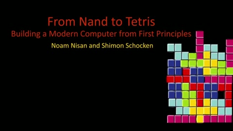 | 00:00.000  | 00:00.000  |
| 1 | — | 00:08.100  | 00:08.100  |
| 2 | 00:09.734 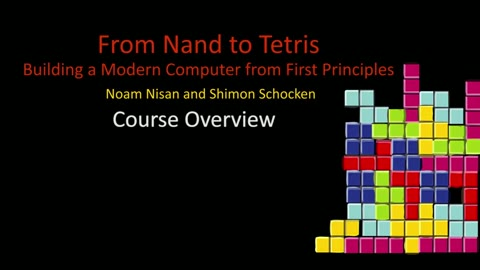 | — | — |
| 3 | — | 00:11.633  | 00:11.633 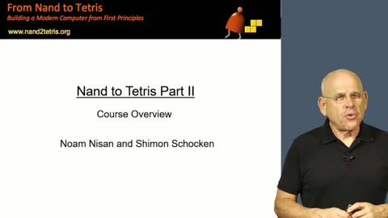 |
| 4 | — | 00:12.633 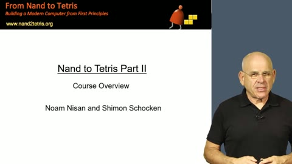 | — |
| 5 | — | 01:15.300  | 01:15.300 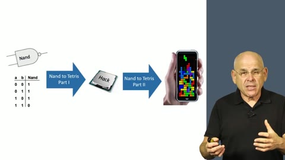 |
| 6 | — | 01:51.933  | 01:51.933  |
| 7 | 02:14.334  | — | — |
| 8 | — | 02:43.500 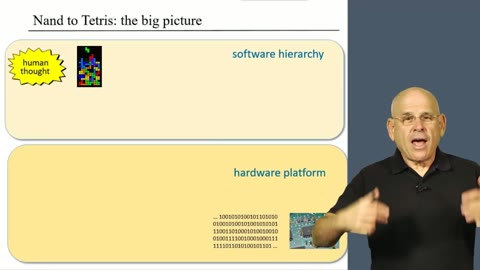 | — |
| 9 | — | 04:56.900  | 04:56.900 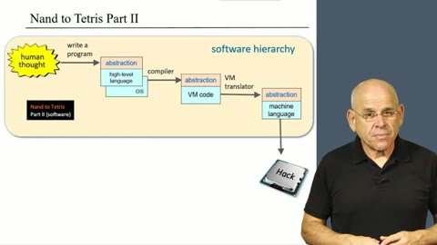 |
| 10 | — | 05:07.467 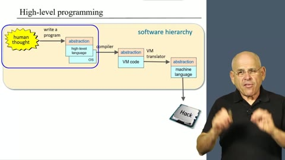 | — |
| 11 | — | 05:17.900 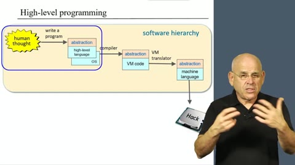 | — |
| 12 | — | 05:20.533 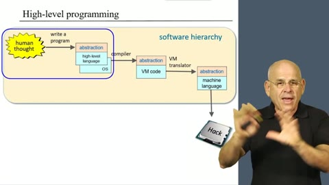 | — |
| 13 | — | 05:45.700 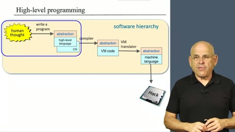 | — |
| 14 | 05:56.300  | — | — |
| 15 | — | 06:33.167  | — |
| 16 | — | 10:03.333 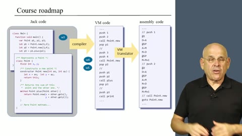 | — |
| 17 | 12:04.000 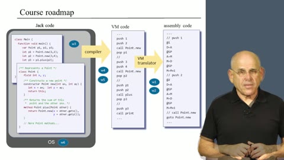 | — | — |
| 18 | — | 15:00.033 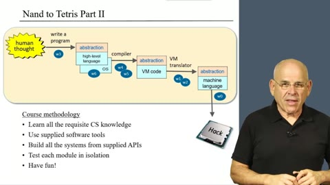 | — |
| 19 | — | 16:21.833 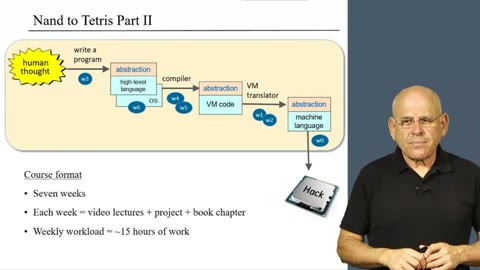 | — |
| 20 | — | — | 17:15.933 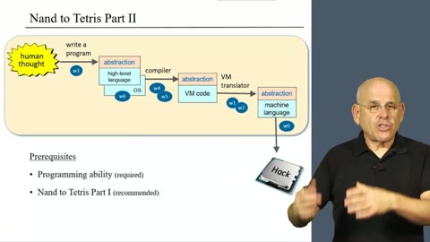 |
| 21 | 18:00.034 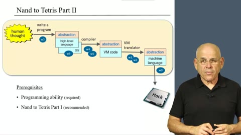 | — | — |

## Goodbye Tokenmaxxing: From AI Usage to Agentic AI Outcomes

Source: 1920x1080, 505.4 s (08:25.414), `goodbye_tokenmaxxing.mp4`

### Summary

| Detector | Process resolution | Shots | Cuts | Model load (s) | Detection (s) | Speed (x realtime) | Mean shot (s) |
|---|---|---:|---:|---:|---:|---:|---:|
| PySceneDetect | 320x180 | 36 | 35 | 0.00 | 114.53 | 4.4 | 14.0 |
| OmniShotCut | 128x96 | 34 | 33 | 0.00 | 102.51 | 4.9 | 14.9 |
| TransNetV2 | 48x27 | 28 | 27 | 0.00 | 94.44 | 5.4 | 18.1 |

### Agreement

Cuts within 0.5 s of each other are counted as the same cut.

| Found by | Cuts |
|---|---:|
| all detectors | 27 |
| 2 detectors | 0 |
| 1 detector | 14 |

| Only found by | Cuts |
|---|---:|
| PySceneDetect | 8 |
| OmniShotCut | 6 |
| TransNetV2 | 0 |

### Cuts, aligned across detectors

Each row is one moment in the video. A cell shows the timestamp (mm:ss.sss) at which that detector starts a new shot and the frame grabbed there; `—` means it found no cut there. The opening shot at 00:00 is listed first for reference.

| # | PySceneDetect | OmniShotCut | TransNetV2 |
|---:|---|---|---|
| 0 | 00:00.000  | 00:00.000  | 00:00.000  |
| 1 | 00:03.937  | — | — |
| 2 | 00:36.236  | 00:36.236  | 00:36.236  |
| 3 | 00:42.242  | 00:42.242  | 00:42.242  |
| 4 | — | 00:43.243  | — |
| 5 | — | 00:43.644  | — |
| 6 | 01:07.902  | 01:07.901  | 01:07.901  |
| 7 | 01:15.608  | 01:15.609  | 01:15.609  |
| 8 | 01:33.961  | 01:33.961  | 01:33.961  |
| 9 | 01:45.539  | 01:45.539  | 01:45.539  |
| 10 | 02:25.445  | 02:25.445  | 02:25.445  |
| 11 | 02:38.658 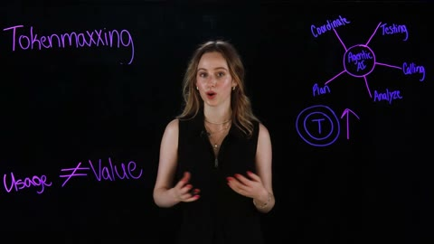 | 02:38.659 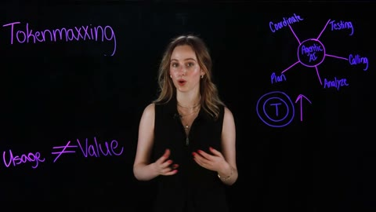 | 02:38.659  |
| 12 | 02:56.877  | 02:56.877  | 02:56.877  |
| 13 | 03:10.057  | 03:10.057  | 03:10.057  |
| 14 | 03:34.047  | 03:34.047  | 03:34.047  |
| 15 | 03:40.454  | — | — |
| 16 | 03:43.190  | 03:43.190  | 03:43.190  |
| 17 | 03:58.171  | — | — |
| 18 | 04:05.646  | 04:05.645  | 04:05.645  |
| 19 | 04:10.016  | — | — |
| 20 | 04:15.889  | — | — |
| 21 | 04:21.094  | — | — |
| 22 | 04:23.496  | 04:23.497  | 04:23.497  |
| 23 | 04:27.701  | — | — |
| 24 | 04:33.607  | — | — |
| 25 | 05:04.938  | 05:04.938  | 05:04.938  |
| 26 | 05:14.080  | 05:14.080  | 05:14.080  |
| 27 | 05:43.577  | 05:43.577  | 05:43.577  |
| 28 | 05:54.988  | 05:54.988  | 05:54.988  |
| 29 | 06:01.695  | 06:01.695  | 06:01.695  |
| 30 | 06:07.000  | 06:07.000  | 06:07.000 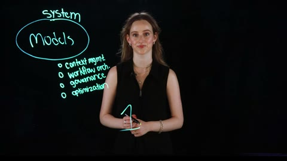 |
| 31 | — | 06:07.367  | — |
| 32 | — | 06:07.968  | — |
| 33 | 06:17.344  | 06:17.344  | 06:17.344  |
| 34 | 06:31.725  | 06:31.725  | 06:31.725  |
| 35 | 06:42.969  | 06:42.969  | 06:42.969  |
| 36 | 07:10.163  | 07:10.163  | 07:10.163  |
| 37 | 07:41.327  | 07:41.328  | 07:41.328  |
| 38 | 07:51.004  | 07:51.004  | 07:51.004  |
| 39 | — | 08:13.426  | — |
| 40 | — | 08:13.727  | — |
| 41 | 08:25.372  | 08:25.372  | 08:25.372  |
